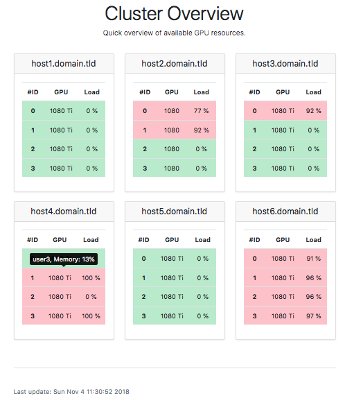

# Web-GPU-Monitor

Simple server monitoring for your GPU cluster.
Periodically calls `nvidia-smi` through SSH and parses it into a website.
The generated website highlights the available GPUs in green and shows the
GPU load.
Occupied GPUs are marked in red. By hovering the entry with your mouse,
it will show you the users which have processes on the machine and how much
GPU memory is consumed.



## Setup

You need to satisfy some Python dependencies.

```
conda env create -f environment.yml
```

## Getting Started

We provide an example CSV which you can use to build the website above.
Call `python render_website.py`.
The result is stored in `output/index.html`.

## Getting Started on Your System

First step is to create a `config.ini` where your credentials and hostnames are specified.

An exemplary ini-file could look like this:

```
[common]
user = yourusername
hosts = host1.domain.tld,host2.domain.tld
```

Save this as `config.ini` in the root of this repository.

Now you can run `python fetch_data.py -c config.ini` to fetch data from
your specified hosts. The result is then saved in `load_data.csv`.
Call `python render_website.py` to create a HTML site out of it.
The result is stored in `output/index.html`.

## Automation

Of course, you want to host this on a webserver and it should automatically
update the website. A simple cronjob does this job for our systems.
In our setting, the page is refreshed every 5 minutes.

You need a user on the machines which can call `nvidia-smi`.
This might be a security issue though. One way to make this more secure is
to use an SSH login-script and limit the user's credibility to this one.

## Possible Extensions

Currently, only the current load is dumped to `load_data.csv`.
However, you could easily adapt this script to support logging over time
by saving the history.
